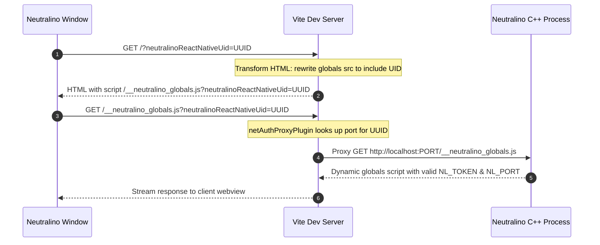

# Authentication & Globals Proxy

To maintain security, Neutralinojs requires all frontend clients to authenticate before accessing native OS APIs. This page details the authentication proxy mechanism implemented in `neuAuthPlugin.ts`.

---

## The Challenge

In a standard Neutralinojs application, the Neutralino desktop executable serves the frontend files directly. It automatically injects runtime variables, auth tokens, and communication ports through a special script:

```html
<script src="/__neutralino_globals.js"></script>
```

However, in development mode with React Native Neutralinojs:

1. The frontend files and HMR scripts are served by the **Vite dev server** (e.g. `http://localhost:8082`).
2. The Neutralino native process runs its own internal C++ server on a separate, dynamically allocated port.
3. If the user opens multiple windows (by pressing <kbd>o</kbd>), each window runs as an independent Neutralino process with its own port and authentication token.

If Vite attempted to serve `/__neutralino_globals.js` as a static file, the authentication tokens would be invalid or missing, breaking all `@neutralinojs/lib` API calls.

---

## The Solution: Dynamic Multi-Instance Proxy

`packages/react-native-neutralinojs/src/vite/neuAuthPlugin.ts` solves this through two coordinated Vite plugins:



### 1. `neuAuthPlugin` (HTML Transformation)

When Neutralino loads the page, `openNeu` appends a unique instance identifier to the query string:
`http://localhost:8082/?neutralinoReactNativeUid=<uuid>`

The `transformIndexHtml` hook inspects the URL. If the UID is present, it rewrites the globals script tag:

```typescript
export function neuAuthPlugin() {
  return {
    name: 'neu-auth-plugin',
    transformIndexHtml(html: string, ctx: IndexHtmlTransformContext) {
      const url = new URL(ctx.originalUrl || ctx.path, 'http://localhost');
      const id = url.searchParams.get('neutralinoReactNativeUid');
      if (!id) return html;

      return html.replace(
        /src\s*=\s*(['"])\s*\/__neutralino_globals\.js\s*\1/g,
        `src="/__neutralino_globals.js?neutralinoReactNativeUid=${id}"`,
      );
    },
  };
}
```

---

### 2. `netAuthProxyPlugin` (HTTP Middleware Proxy)

When the webview requests `/__neutralino_globals.js?neutralinoReactNativeUid=<uuid>`, Vite's middleware intercepts the request:

```typescript
export function netAuthProxyPlugin() {
  return {
    name: 'net-auth-proxy-plugin',
    configureServer(server: NeutralinoDevServer) {
      server.middlewares.use((req, res, next) => {
        if (req?.url?.includes('/__neutralino_globals.js')) {
          const url = new URL(req.url, 'http://localhost');
          const id = url.searchParams.get('neutralinoReactNativeUid');
          if (!id) return next();

          const port = server?.neutralinoAuthPorts?.[id];
          if (!port) return next();

          const proxyUrl = `http://localhost:${port}/__neutralino_globals.js`;
          return http.get(proxyUrl, (proxyRes) => {
            res.writeHead(proxyRes.statusCode || 200, proxyRes.headers);
            proxyRes.pipe(res);
          });
        }
        next();
      });
    },
  };
}
```

### Key Architectural Benefits

1. **Zero Client-Side Configuration:** Developers do not need to configure ports or manually copy authentication tokens into their code.
2. **True Multi-Window Isolation:** Spawning multiple windows via the terminal (<kbd>o</kbd>) assigns unique ports and tokens to each window without conflicts.
3. **Seamless Production Transition:** In production builds, the static web files are served directly by Neutralino, where native `/__neutralino_globals.js` works identically without requiring proxies.
