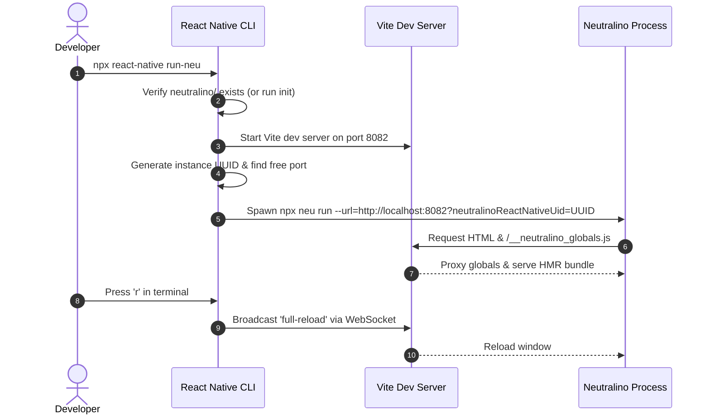

# CLI Integration

React Native uses `@react-native-community/cli` as its extensible command-line harness. `react-native-neutralinojs` hooks directly into this system via its `react-native.config.cjs` manifest.

---

## The Configuration Manifest

Located at the root of `packages/react-native-neutralinojs/react-native.config.cjs`:

```javascript
module.exports = {
  platforms: {
    neu: {
      dependencyConfig: () => ({}),
      projectConfig: () => ({
        sourceDir: 'neutralino',
      }),
    },
  },
  commands: [
    { name: 'init-neu', func: require('./dist/cli/init-neu.js') },
    { name: 'update-neu', func: require('./dist/cli/update-neu.js') },
    { name: 'run-neu', func: require('./dist/cli/run-neu.js') },
    { name: 'build-neu', func: require('./dist/cli/build-neu.js') },
  ],
  healthChecks: [
    {
      label: 'Neutralino',
      healthchecks: require('./dist/cli/doctor.js'),
    },
  ],
};
```

---

## Platform Registration (`platforms.neu`)

By defining `platforms.neu`, React Native CLI recognizes `neu` as a first-class platform alongside `ios`, `android`, `windows`, and `macos`.

- `sourceDir`: Points to `neutralino`, establishing that native desktop configuration files live inside this directory.

---

## Command Lifecycle & Execution

### Dev Server Lifecycle (`run-neu`)



### Stdin Raw Mode Handling

`run.ts` puts `process.stdin` into raw mode to capture single keypresses:

- **`r` key:** Calls `server.ws.send({ type: 'full-reload' })`, triggering a live reload across all connected Neutralino webview instances without restarting the dev server.
- **`o` key:** Calls `openNeu(url)`, allocating a new session UUID and spawning a parallel desktop window.
- **`Ctrl+C`:** Gracefully intercepts exit, cleans up streams, and terminates child processes.

### Production Build Lifecycle (`build-neu`)

When building for production:

1. `build-neu.ts` executes `vite.build()` against `defaultViteConfig()`, compiling the bundle into `neutralino/vite-dist/`.
2. Changes the working directory to `neutralino/`.
3. Runs `npx neu build ${argv}`, copying the static bundle into Neutralino's asset payload and creating standalone cross-platform executables.
