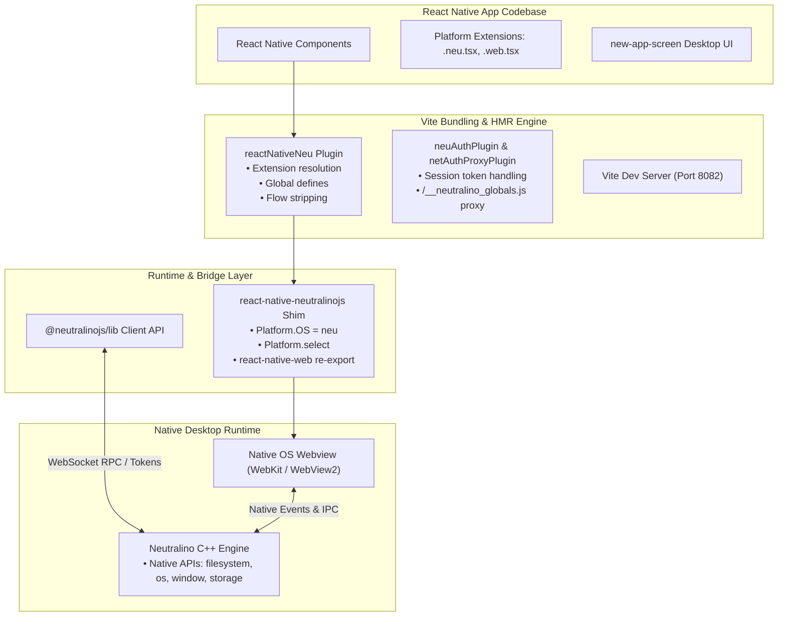

# Architecture Overview

This section explains the internals of React Native Neutralinojs, detailing how the CLI, Vite bundler, React Native Web shim, and Neutralino native runtime collaborate.

---

## High-Level System Architecture

---

## Component Roles & Responsibilities

### 1. The Core CLI Plugin (`react-native-neutralinojs`)

Registers the `neu` platform with `@react-native-community/cli`. When running `run-neu` or `build-neu`, this package orchestrates the dev server, spawns the Neutralino process, and monitors lifecycle events.

### 2. The Vite Pipeline

Rather than relying on Metro, Vite processes ES modules directly. A custom plugin configures Rollup/Rolldown, strips Flow type annotations from legacy React Native packages, and injects platform defines (`process.env.EXPO_OS = 'neu'`).

### 3. The Runtime Shim

When application code imports from `react-native`, the Vite bundler redirects the import to the package's shim (`exports/index.js`). This shim exposes `Platform.OS = 'neu'`, `Platform.select`, and transparently proxies standard components to `react-native-web`.

### 4. Authentication & Dynamic Port Proxying

Neutralino requires client applications to send an authentication token to communicate with its local C++ server. The custom authentication proxy bridges Vite's dev server with each independent Neutralino window instance.

### 5. Desktop Screen Components (`@react-native-neutralinojs/new-app-screen`)

Provides desktop-optimized UI components replacing the default mobile screen template, delegating hyperlinks to `@neutralinojs/lib` (`Neutralino.os.open`).
