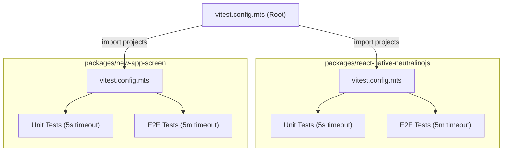

# Testing & Monorepo Tooling

This monorepo uses **[Vitest](https://vitest.dev/)** configured with a multi-project (Projects) architecture to manage unit and end-to-end (E2E) tests both globally and individually per package.

---

## 1. Multi-Project Configuration Architecture

Rather than relying on directory globs that Vitest treats as flat projects without native nested hierarchy resolution, each package exports its typed projects, and the root configuration aggregates them:



### Configuration Files:

- `vitest.config.mts` (Root): Aggregates projects across all monorepo packages for unified execution.
- `packages/react-native-neutralinojs/vitest.config.mts`: Defines `:unit` and `:e2e` projects for the core package.
- `packages/new-app-screen/vitest.config.mts`: Defines `:unit` and `:e2e` projects for the desktop welcome screen.

---

## 2. Naming & File Conventions

| Test Type | File Pattern                                                | Timeout         | Recommended Location                                   |
| :-------- | :---------------------------------------------------------- | :-------------- | :----------------------------------------------------- |
| **Unit**  | `*.test.ts`, `*.spec.ts`, `*.test.tsx` (excludes `*.e2e.*`) | `5000ms` (5s)   | `packages/<pkg>/tests/unit/` or collocated with source |
| **E2E**   | `*.e2e.test.ts`, `*.e2e.ts`, `*.e2e.spec.tsx`               | `300000ms` (5m) | `packages/<pkg>/tests/e2e/`                            |

::: tip E2E Isolation
Any test file containing `.e2e.` in its filename is automatically excluded from the unit runner and will only be executed by the E2E runner with an extended timeout (5 minutes / 300,000ms for test execution and setup/teardown hooks).
:::

---

## 3. Available Test Commands

### From the Monorepo Root:

```bash
# Run all test suites across all packages
pnpm test

# Run only unit tests
pnpm run test:unit

# Run only E2E tests
pnpm run test:e2e

# Interactive watch mode
pnpm run test:watch

# Filter by a specific project name
pnpm vitest --project react-native-neutralinojs:unit
pnpm vitest --project new-app-screen:unit
```

### From an Individual Package:

```bash
# Run tests for a specific workspace package
pnpm --filter react-native-neutralinojs test:unit
pnpm --filter @react-native-neutralinojs/new-app-screen test:unit
```

---

## 4. Code Hygiene Toolchain

The monorepo uses cutting-edge Rust-based JavaScript toolchains for lightning-fast linting and formatting:

- **Oxlint**: Ultra-fast linter replacing ESLint for core static checks.
  ```bash
  pnpm run lint
  pnpm run lint:fix
  ```
- **Oxfmt**: Blazing-fast code formatter replacing Prettier.
  ```bash
  pnpm run format:check
  pnpm run format
  ```

---

## 5. Adding a New Monorepo Package

When creating a new package in `packages/new-package`:

### 1. Create its `vitest.config.mts`:

```typescript
import { fileURLToPath } from 'node:url';
import { defineConfig, defineProject } from 'vitest/config';

const packageRoot = fileURLToPath(new URL('.', import.meta.url));

export const unitProject = defineProject({
  root: packageRoot,
  test: {
    name: 'new-package:unit',
    environment: 'node',
    include: ['**/*.{test,spec}.?(c|m)[jt]s?(x)'],
    exclude: ['**/node_modules/**', '**/dist/**', '**/*.e2e.*'],
    testTimeout: 5000,
  },
});

export const e2eProject = defineProject({
  root: packageRoot,
  test: {
    name: 'new-package:e2e',
    environment: 'node',
    include: ['**/*.e2e.{test,spec}.?(c|m)[jt]s?(x)', '**/*.e2e.?(c|m)[jt]s?(x)'],
    exclude: ['**/node_modules/**', '**/dist/**'],
    testTimeout: 300000,
    hookTimeout: 300000,
  },
});

export const projects = [unitProject, e2eProject];

export default defineConfig({
  test: {
    projects,
    passWithNoTests: true,
  },
});
```

### 2. Register it in root `vitest.config.mts`:

```typescript
import { projects as newPackageProjects } from './packages/new-package/vitest.config.mts';

export default defineConfig({
  test: {
    passWithNoTests: true,
    projects: [...reactNativeNeutralinojsProjects, ...newAppScreenProjects, ...newPackageProjects],
  },
});
```
