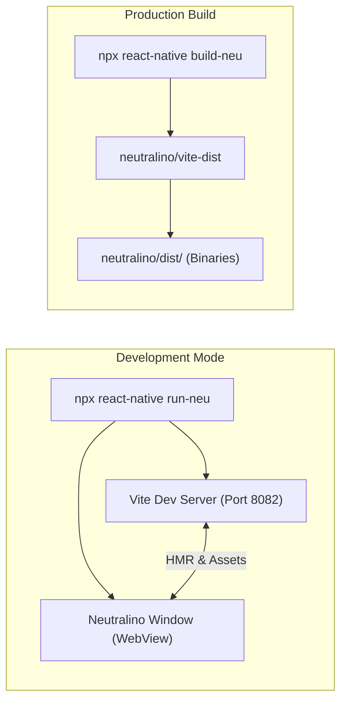

# Getting Started

Welcome to the React Native Neutralinojs developer guide. This guide walks you through setting up your environment, prerequisites, and understanding the core workflow.

---

## Prerequisites

Before using React Native Neutralinojs, verify that your machine meets the following requirements:

### 1. Node.js & Package Manager

- **Node.js**: `>= 22` recommended (supports LTS versions)
- **Package Manager**: `pnpm` (`>= 9`, recommended `12.x`), `npm`, or `yarn`

### 2. React Native Project

- A React Native project targeting version `>= 0.70`.
- Standard project structure managed with `@react-native-community/cli`.

### 3. Operating System Webview

Neutralinojs uses the system's native webview component:

- **Windows:** Microsoft Edge WebView2 (installed by default on Windows 10 and 11).
- **macOS:** Apple WebKit (preinstalled with macOS).
- **Linux:** WebKitGTK (`libwebkit2gtk-4.0` or `libwebkit2gtk-4.1`). If you are running an Ubuntu/Debian minimal installation:
  ```bash
  sudo apt-get install -y libwebkit2gtk-4.1-0
  ```

---

## How It Works at a Glance



1. **Development (`run-neu`):**
   - Automatically initializes the `neutralino/` workspace directory if not present.
   - Launches a customized Vite development server.
   - Spawns the native Neutralinojs desktop window pointing to the dev server with Hot Module Replacement enabled.

2. **Production (`build-neu`):**
   - Compiles your React Native code using Vite into static optimized assets under `neutralino/vite-dist/`.
   - Packages your app with Neutralinojs into lightweight standalone executables for Linux, macOS, and Windows.

---

## Next Steps

Proceed to the [Installation Guide](./installation) to add React Native Neutralinojs to your existing project.
