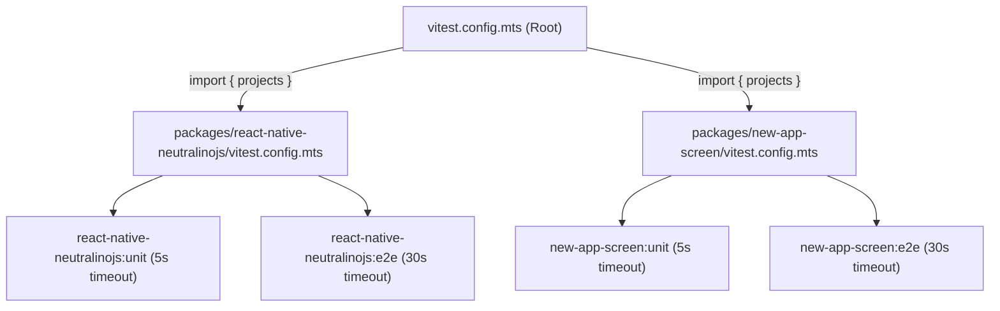

# Testing Guide

This monorepo uses **[Vitest](https://vitest.dev/)** configured with a multi-project (Projects) architecture to manage unit and end-to-end (E2E) tests both globally and individually per package.

---

## 1. Configuration Architecture

Rather than relying on directory globs that Vitest treats as flat projects without native nested hierarchy resolution, each package exports its typed projects, and the root configuration aggregates them:



### Configuration Files:

- [vitest.config.mts](../vitest.config.mts) (Root): Aggregates projects across all monorepo packages for a single unified execution.
- [packages/react-native-neutralinojs/vitest.config.mts](../packages/react-native-neutralinojs/vitest.config.mts): Defines and exports the `:unit` and `:e2e` projects for the core package.
- [packages/new-app-screen/vitest.config.mts](../packages/new-app-screen/vitest.config.mts): Defines and exports the `:unit` and `:e2e` projects for the templates and screen components package.

---

## 2. Naming and File Conventions

| Test Type | File Pattern                                                | Timeout         | Recommended Location                                        |
| :-------- | :---------------------------------------------------------- | :-------------- | :---------------------------------------------------------- |
| **Unit**  | `*.test.ts`, `*.spec.ts`, `*.test.tsx` (excludes `*.e2e.*`) | `5000ms` (5s)   | `packages/<pkg>/tests/unit/` or collocated with source code |
| **E2E**   | `*.e2e.test.ts`, `*.e2e.ts`, `*.e2e.spec.tsx`               | `30000ms` (30s) | `packages/<pkg>/tests/e2e/`                                 |

> [!NOTE]
> Any test file containing `.e2e.` in its filename is automatically excluded from the unit runner and will only be executed by the E2E runner with an extended timeout (30 seconds for tests and setup/teardown hooks).

---

## 3. Available Commands

### From the monorepo root:

- **Run all tests:**
  ```bash
  pnpm test
  ```
- **Run only unit tests (all packages):**
  ```bash
  pnpm run test:unit
  ```
- **Run only E2E tests:**
  ```bash
  pnpm run test:e2e
  ```
- **Interactive watch mode:**
  ```bash
  pnpm run test:watch
  ```
- **Filter by a specific project using the CLI:**
  ```bash
  pnpm vitest --project react-native-neutralinojs:unit
  pnpm vitest --project new-app-screen:unit
  ```
- **Lint code and tests with Oxlint:**
  ```bash
  pnpm run lint
  pnpm run lint:fix
  ```
- **Check or apply formatting with Oxfmt:**
  ```bash
  pnpm run format:check
  pnpm run format
  ```

### From an individual package:

You can run tests from inside the package directory or using pnpm's filter:

```bash
# Example: run only in react-native-neutralinojs
pnpm --filter react-native-neutralinojs test:unit

# Example: run only in new-app-screen
pnpm --filter @react-native-neutralinojs/new-app-screen test:unit
```

---

## 4. Existing Test Structure

### `packages/react-native-neutralinojs`:

- Configuration: [vitest.config.mts](../packages/react-native-neutralinojs/vitest.config.mts)
- **Unit Tests**:
  - [tests/unit/neu/exists.test.ts](../packages/react-native-neutralinojs/tests/unit/neu/exists.test.ts): Verifies `neutralino.config.json` and binary detection logic.
  - [tests/unit/utils/art.test.ts](../packages/react-native-neutralinojs/tests/unit/utils/art.test.ts): ASCII Figlet banner and console welcome utilities.
  - [tests/unit/utils/findPort.test.ts](../packages/react-native-neutralinojs/tests/unit/utils/findPort.test.ts): Available TCP port detection.
  - [tests/unit/utils/log.test.ts](../packages/react-native-neutralinojs/tests/unit/utils/log.test.ts): Formatted logging output (info, error, warn, raw).
  - [tests/unit/vite/defaultConfig.test.ts](../packages/react-native-neutralinojs/tests/unit/vite/defaultConfig.test.ts): Default Vite configuration options.
  - [tests/unit/vite/loadConfig.test.ts](../packages/react-native-neutralinojs/tests/unit/vite/loadConfig.test.ts): Dynamic loading and fallback of vite.config files.
  - [tests/unit/vite/neuAuthPlugin.test.ts](../packages/react-native-neutralinojs/tests/unit/vite/neuAuthPlugin.test.ts): Neutralino authentication and proxy plugins.
- **E2E Tests**:
  - [tests/e2e/cli.e2e.test.ts](../packages/react-native-neutralinojs/tests/e2e/cli.e2e.test.ts): CLI lifecycle E2E suite (currently skipped placeholder).

### `packages/new-app-screen`:

- Configuration: [vitest.config.mts](../packages/new-app-screen/vitest.config.mts)
- **Unit Tests**:
  - [tests/unit/index.test.ts](../packages/new-app-screen/tests/unit/index.test.ts): Public package exports and components.
  - [tests/unit/Links.test.ts](../packages/new-app-screen/tests/unit/Links.test.ts): Official React Native documentation resource links.
  - [tests/unit/Theme.test.ts](../packages/new-app-screen/tests/unit/Theme.test.ts): Color palettes, light/dark themes, and contrast.
- **E2E Tests**:
  - [tests/e2e/screen.e2e.test.ts](../packages/new-app-screen/tests/e2e/screen.e2e.test.ts): Desktop UI window rendering E2E suite (currently skipped placeholder).

---

## 5. Adding a New Package

When creating a new package in `packages/new-package`:

1. Create its `packages/new-package/vitest.config.mts` file:

   ```typescript
   import { fileURLToPath } from 'node:url';
   import { defineConfig, defineProject } from 'vitest/config';

   const packageRoot = fileURLToPath(new URL('.', import.meta.url));

   export const unitProject = defineProject({
     root: packageRoot,
     test: {
       name: 'new-package:unit',
       environment: 'node',
       include: ['**/*.{test,spec}.?(c|m)[jt]s?(x)'],
       exclude: ['**/node_modules/**', '**/dist/**', '**/*.e2e.*'],
       testTimeout: 5000,
     },
   });

   export const e2eProject = defineProject({
     root: packageRoot,
     test: {
       name: 'new-package:e2e',
       environment: 'node',
       include: ['**/*.e2e.{test,spec}.?(c|m)[jt]s?(x)', '**/*.e2e.?(c|m)[jt]s?(x)'],
       exclude: ['**/node_modules/**', '**/dist/**'],
       testTimeout: 30000,
       hookTimeout: 30000,
     },
   });

   export const projects = [unitProject, e2eProject];

   export default defineConfig({
     test: {
       projects,
       passWithNoTests: true,
     },
   });
   ```

2. Import it into the root [vitest.config.mts](../vitest.config.mts):
   ```typescript
   import { projects as newPackageProjects } from './packages/new-package/vitest.config.mts';

   export default defineConfig({
     test: {
       passWithNoTests: true,
       projects: [
         ...reactNativeNeutralinojsProjects,
         ...newAppScreenProjects,
         ...newPackageProjects,
       ],
     },
   });
   ```
